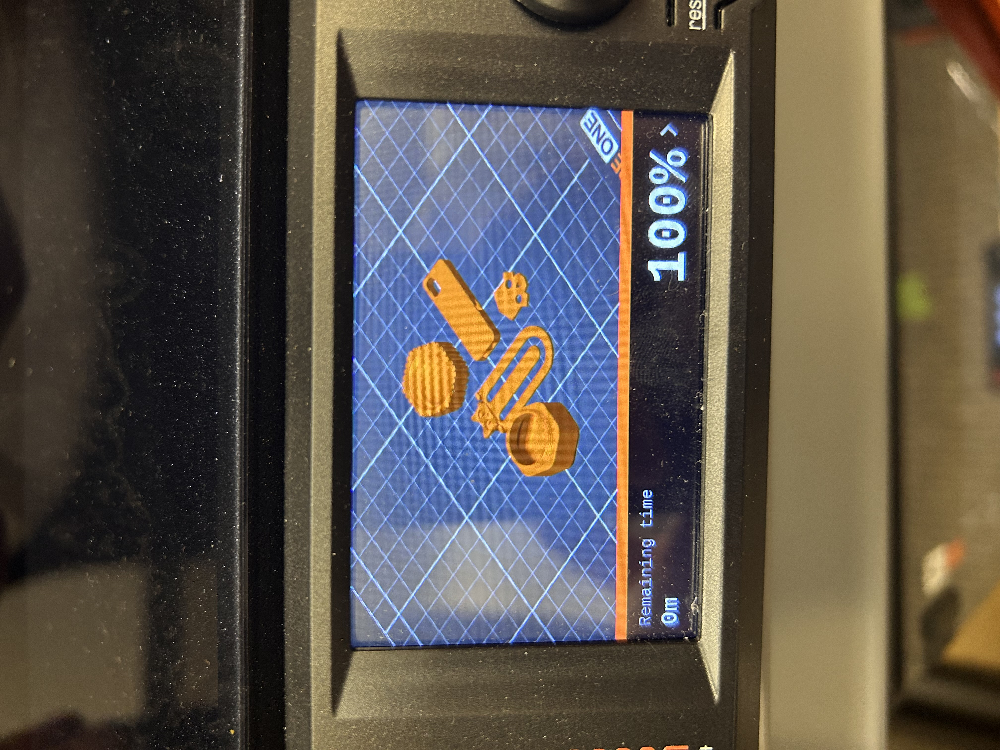
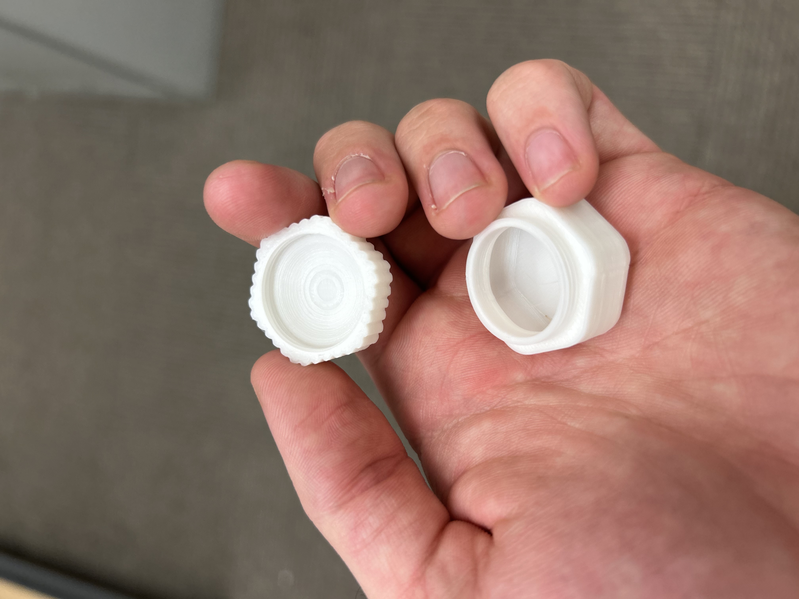
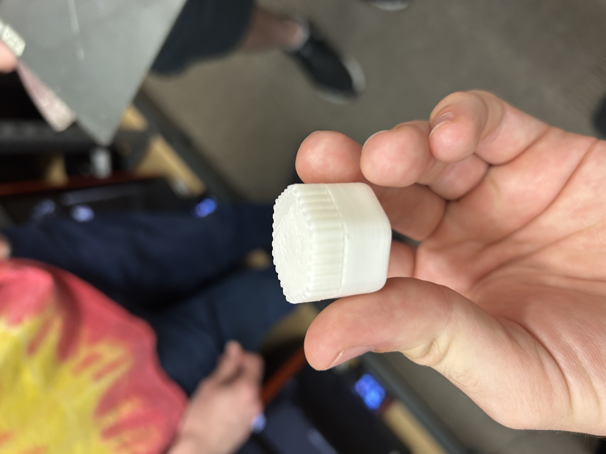

# Lab 2) Print Something Small
 
 
## Design rule for Additive Manufacturing?

 A minimum wall thickness is needed to bond layers securely together, but thin enough to avoid trapped heat or internal stress. If a wall is too thin to hold together, the materials will not hold together and will fall apart.

 Source : Google Search

## FDM Specific Consideration - How to work around it?

 For instance, warping is a FDM specific consideration where the material loses its original geometry by bending or twisting. This is typically worked around by adding ribs or braces to the material. This creates a structural integrity to the build that resists bending or warping from occurring. 

 Source : Google Search

 ## Group Findings

 I learned from my group discussion that the 45 degree rule is a very critical design rule for additive manufacturing. It allows the material to hold together much more securely than adjoining the materials in random locations. 

## Printing Something...

### Downloading

When looking for an object to print out, I navigated to printables.com and search the phrase "small print." Using this search, I surfed to find an object that looked like it fit the given criteria; No more than 2 by 2 inches, .25 inches tall, and less than an hour and a half print time.

[Download Model Files](small-travel-container-model_files.zip)

Additionally, I thought the tiny storage container would be a cool and unique build to do. Not to mention I could potentially use it for practical use. 

### Preprocessor

The next step was to upload the file into Prusa Slicer. When arranging all of our builds on the board, it was made apparent to us to center our builds as close together as possible. Doing this would only reduce the printing time of our builds. After uploading my container, I realized it was much taller than I had originally believed it would be. To fix this, we seperated the cap from the base of the container into two separate builds. 

Another issue I faced was that my build was much larger than I had originally thought. To fix this, we had to scale my build down a little bit. While the build came out great, it would have been a greater idea to pick an object that was less bulky and had a smaller ceiling that the container did. No supports were needed for my build.

### Print 

After arranging our builds and downloading it to our USB, we made our way to our 3D printer. The steps were relatively easy; I plugged in the USB, hit start, and waiting for our builds to print. I was shocked at how easy the whole process was. 

This was a before and after picture of the 3D printing process. The printer utilized PLA filament and automatically placed the filament down layer by layer until all of the builds were complete. I worked with Nathan, Derek, and Luz and we used printer 103. 

[View Video 1](IMG_2848%20%281%29.mov)

[View Video 2](IMG_2847%20%281%29.mov)

This is what my final product looks like:

### Lessons Learned

I learned many things about this process that I never before knew. I learned that we use filament for our 3D prints and that the process itself is relatively easy. I learned that the printer starts from the base platform and goes up in layers, and that the farther apart the builds are from one another, the longer the printing time will be. 

Resources : printables.com , prusa3d.com/prusaslicer

