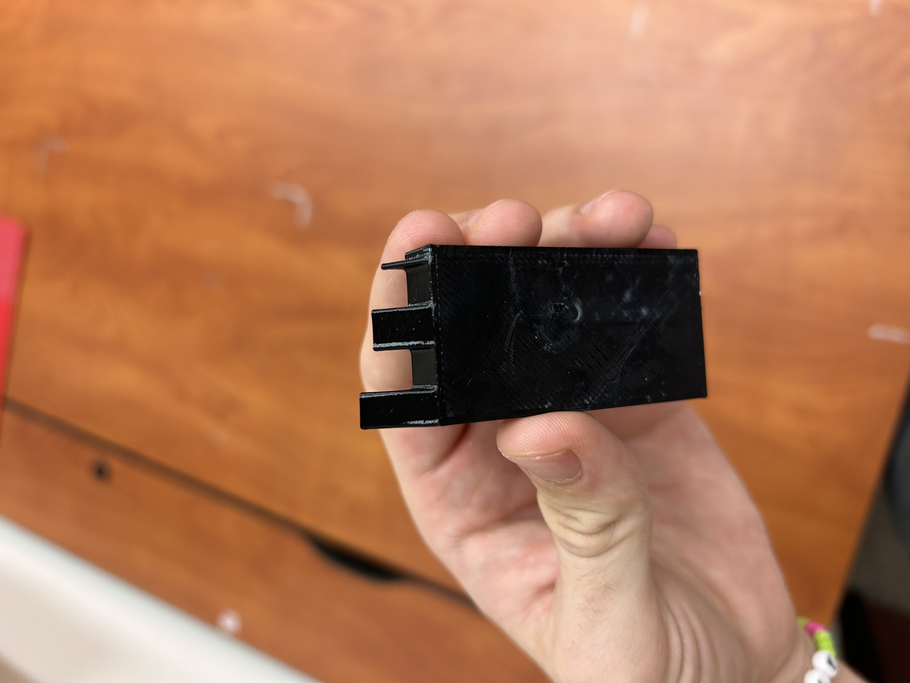
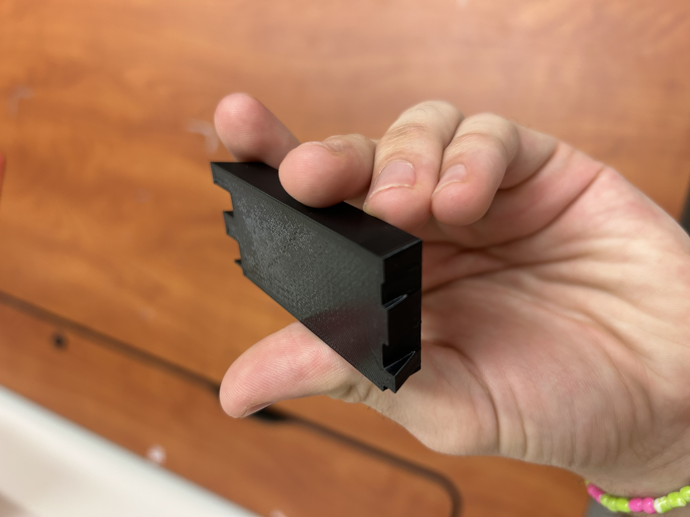
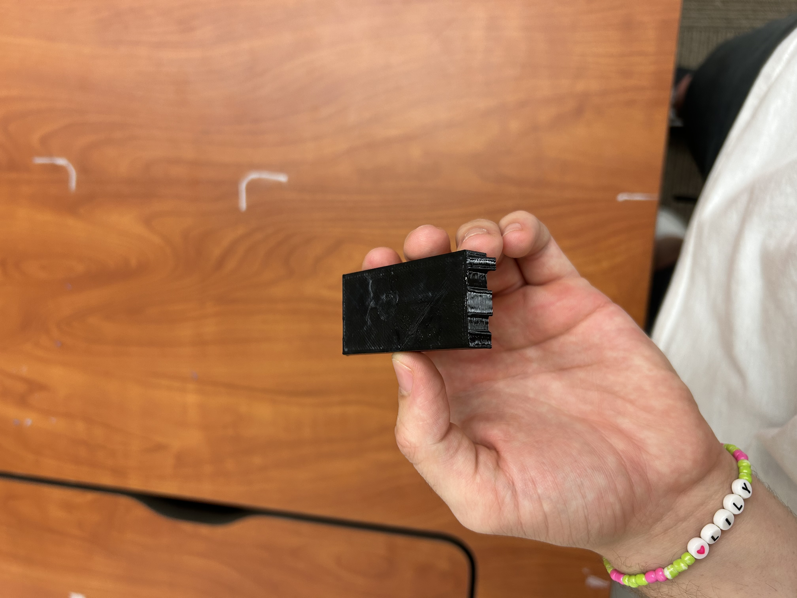

# Lab 04) Benchmark a Parameter

For this week, our objective is to utilize different 3D printing tests in order to test the limits to which a product fails once being printed. It was our goal to basically test how manufacturable our designs really are. 

## Pick a Parameter

I decided to observe the Overhang Angle Test as my parameter. I utilized the below image as an inspiration for my design.

The main objective of this test is to see how material overhanging at different angles fails and when it succeeds. It can be taken from this image that the larger the angle between the height dimension of the object and the hypotenuse of the overhang, the more likely the object is to fail. My initial prediction is that the limit will be at the 45 degree angle mark similar to the design above. 

## Design Documentation

When building the design, I wanted it to be unique and original from the inspiration image above. However, one aspect I aimed to replicate was the varying overhang angles showing the progression of the failure. I began by creating a rectangular extrude and began to sketch overhanging ramps on one side of the long face of the block. I noticed quickly that this would be a very bulky block if I simply had the ramps extruding on just one side. It was here I had the idea to create the overhangs on both sides of the block to create a symmetry of the block as well as keeping the printing time to a minimum. 

This was my rough design of the block. While I was certain I could make it work, I felt as though making the differing angles so close together could make the discrepancies a lot more difficult to recognize. It was here I had the idea to add some spacing between each of the overhangs.

After messing around with the spacing and dimensions, I finalized my design of the block. To add a more distinguished factor of my block, I delegated a different thickness for each of the overhangs to conclude how the thickness contributes to the test. 

## Preprocessor 

The next course of action was exporting the design onto PrusaSlicer;

I knew that the selected conditions that I chose on PrusaSlicer were incredibly crucial for the outcome of the test. However, I was unsure on whether choosing certain conditions such as brim or higher infill would make the block more secure, and ultimately prevent the blocks ability to fail. It was for this reason that I opted to add only a small perimeter around the block and keep the infill as it is. Little did I know this decision would later bite me in the butt. 

## Printing

It was then time to print my artifact and see if it failed as I expected it to. 

https://github.com/user-attachments/assets/df843668-b94d-4a91-847f-525b53494e55

The printing process was very smooth and it printed very fast. I was expecting some failure on the overhanging ramp, but it was layered pretty smoothly. 

After the my print came out, I realized there were many other parameters I probably should have changed to truly test the extent to my block. 

## Lessons Learned 

There were several things I learned throughout the process. For one I realized that my print should have been scaled to be much larger. With a larger hypotenuse on each of the ramps, I would have been able to fully test how each of the angles failed on a larger scale. I believe that one of the reasons I did not observe my block reaching failure is how small the scale was. Another way I believe I could have observed failure with the test is by increasing the overhanging angles past 45 degrees. Another thing I would change is adding less infill and support to print then listed as standard. This would reduce the structural integrity of the print and allow it to fail easier. A final thing I would change is increasing the overall height of the block and make it less flat. This would allow for the hypotenuses to be of a larger length and observe the failure at an easier extent. This took me only a few hours to design, print, and note my errors in my testing. I have gathered a lot from this lab and what causes printing failures.

## Sources

[https://4075618.fs1.hubspotusercontent-na1.net/hubfs/4075618/Gated%20content%20-%20PL%20Network%20-%202024/PL_3DP_Design_Rules_EN.pdf?utm_campaign=Gated%20Content%20Downloads&utm_medium=email&_hsmi=287588333&_hsenc=p2ANqtz-9fy_88Zy4gmXy_JiZW5Siez9y-bqLXe67GUmRFxhgzJCNrwlVRgvjp5BoVD8iVfLwIuHXrVMbXPx9zn6wuEYij-ZjYW4rQwUCAJOcqFh4TgSuYK9A&utm_content=287588333&utm_source=hs_automation](url)

[https://www.printables.com/model/46948-overhang-angle-test/files#preview](url)
